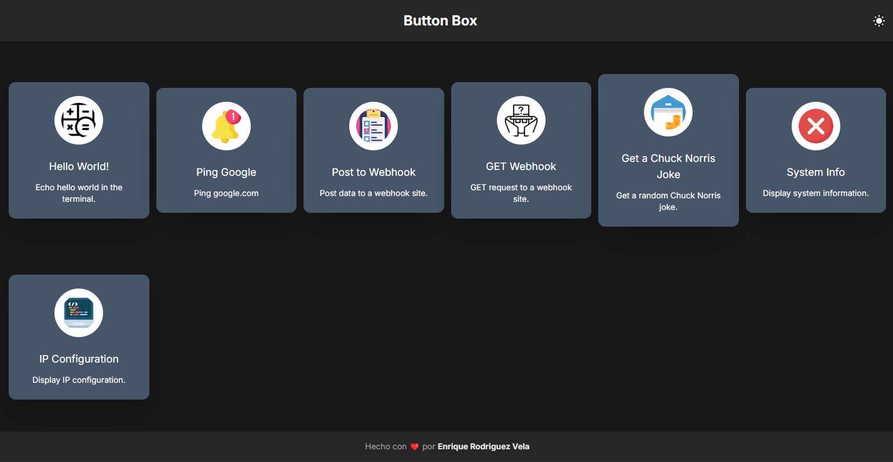

> ¡Hola! Estoy feliz de anunciar que no continuaré con el desarrollo de ButtonBox, ya que ButtonBox no era más que un proyecto para probar mis habilidades y desarrollar un mejor tema para Olivetin. Dado que a la gente le gustó el tema, decidí que, en lugar de reinventar la rueda e intentar reescribir toda la aplicación Olivetin en Next.js (lo cual no es posible debido a algunas limitaciones), simplemente puedo escribir el tema que a la gente le gustó. Puedes ver el tema "ButtonBox" [aquí](https://www.olivetin.app/themes/posts/buttonbox/), ¡espero que te guste :)

> Si aún deseas usar ButtonBox por alguna razón, puedes construir la imagen Docker con `npm run build:image` y lanzar el contenedor ButtonBox con `npm run start:image`.

> **Nota:** A partir de ahora, seré yo quien continúe el desarrollo de ButtonBox. Planeo seguir mejorando la aplicación y añadir nuevas funcionalidades según las sugerencias de la comunidad. ¡Mantente atento a las próximas actualizaciones!

  <h1>ButtonBox</h1>
  
Ejecuta tus tareas de shell con un solo clic

Este proyecto está inspirado en [Olivetin](https://www.olivetin.app/), es la misma aplicación pero con una interfaz de usuario más moderna (y probablemente con menos funciones, jaja).

### Instalación ⬇️

Actualmente, la instalación no es tan sencilla, pero estoy trabajando en una solución para facilitar la instalación de la aplicación. Por ahora, necesitas construir la aplicación y luego ejecutarla usando Node.

Primero, instala los requisitos:

\`\`\`bash
npm install
\`\`\`

Luego, construye la aplicación con este comando:

\`\`\`bash
npm run build
\`\`\`

Finalmente, ejecuta la aplicación:

\`\`\`bash
npm run start
\`\`\`

La aplicación debería estar escuchando en \`http://localhost:3000\`.

### Configuración ✏️

Todos los botones se configuran con estas 4 opciones:

| Nombre        | Descripción                         | Requerido |
| ------------- | ----------------------------------- | --------- |
| `name`        | El título del botón.                | sí        |
| `icon`        | La URL del ícono a utilizar.        | no        |
| `description` | Una pequeña descripción del botón.  | no        |
| `command`     | El comando a ejecutar.              | sí        |

Aquí tienes un ejemplo de configuración:

\`\`\`yaml
buttons:
  - name: ¡Hola mundo!
    description: Muestra "Hola mundo" en el terminal.
    command: echo "Hola, mundo!"
\`\`\`

### Contribuir ❤️

Si te gusta el proyecto y quieres contribuir, puedes hacerlo bifurcando el proyecto, realizando tus cambios y abriendo una solicitud de extracción. Cualquier ayuda es apreciada.

### Licencia 📜

El proyecto está licenciado bajo la Licencia GPL V3. Puedes modificar, distribuir y copiar el código siempre y cuando mantengas los cambios en los archivos fuente. Cualquier modificación que realices utilizando un compilador también debe estar licenciada bajo la GPL e incluir instrucciones de compilación e instalación.
